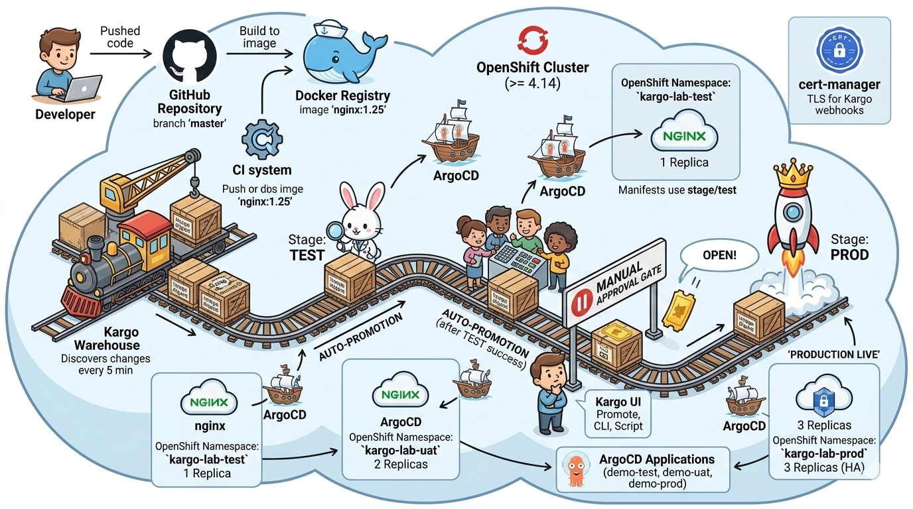
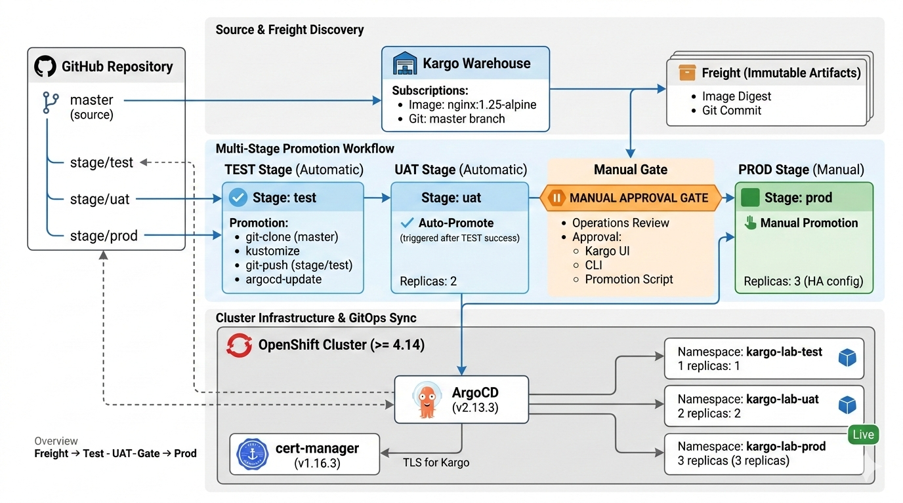
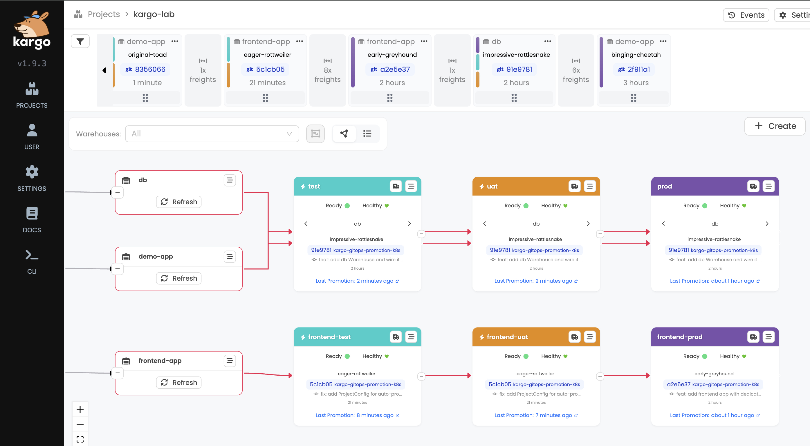

# Kargo GitOps Promotion Pipelines

[](LICENSE)
[](https://docs.openshift.com/container-platform/)
[](https://kargo.io/)
[](https://argo-cd.readthedocs.io/)

**Learn Kargo by building** Progressive delivery pipelines on OpenShift, from zero to multi-stage promotion in hands-on labs.



## 📋 Table of Contents

- [Overview](#-overview)
- [Technology Stack](#-technology-stack)
- [Architecture & Flow](#-architecture--flow)
- [Complete Workflow](#-complete-workflow)
- [Quick Start](#-quick-start)
- [Learning Path](#-learning-path)
- [Repository Structure](#-repository-structure)
- [Key Concepts](#-key-concepts)
- [Troubleshooting](#-troubleshooting)
- [Cleanup](#-cleanup)

## 🎯 Overview

This repository provides a **complete, hands-on learning experience** for Kargo a next-generation GitOps promotion engine. Through progressive labs, you'll build production-ready delivery pipelines that automate artifact promotion across multiple environments.



### What You'll Build

A **multi-application, multi-stage promotion pipeline** featuring:

- **3 Applications**: Demo app (nginx), Frontend, Database
- **3 Environments**: Test → UAT → Production
- **Automated Promotions**: Test and UAT auto-promote
- **Manual Gates**: Production requires approval
- **GitOps Integration**: Full ArgoCD synchronization
- **Stage-specific Branches**: Isolated configuration per environment



### What Makes This Different

- ✅ **Progressive Learning**: Each lab builds on the previous
- ✅ **Production Patterns**: Real-world multi-stage pipelines
- ✅ **Verification Scripts**: Automated validation at each step
- ✅ **Complete Examples**: Three different application types
- ✅ **OpenShift Native**: Optimized for OpenShift platform

## 🛠️ Technology Stack

| Component        | Version     | Purpose                     | Role in Pipeline                              |
| ---------------- | ----------- | --------------------------- | --------------------------------------------- |
| **Kargo**        | v1.9.3      | Progressive delivery engine | Orchestrates artifact promotion across stages |
| **ArgoCD**       | v2.13.3     | GitOps continuous delivery  | Syncs promoted manifests to Kubernetes        |
| **cert-manager** | v1.16.3     | Certificate management      | Provides TLS for Kargo webhooks               |
| **OpenShift**    | >= 4.14     | Kubernetes platform         | Hosts all infrastructure and applications     |
| **Kustomize**    | Built-in    | Manifest customization      | Manages environment-specific configs          |
| **nginx**        | 1.25-alpine | Demo application            | Example containerized workload                |

### Component Interactions

```
┌────────────────────────────────────────────────────────────────┐
│                         OpenShift Cluster                      │
│                                                                │
│  ┌──────────────┐    ┌──────────────┐    ┌──────────────┐      │
│  │ cert-manager │───▶│    Kargo     │◀──▶│   ArgoCD     │      │
│  │  (TLS certs) │    │ (Promotion)  │    │  (GitOps)    │      │
│  └──────────────┘    └──────┬───────┘    └──────┬───────┘      │
│                             │                   │              │
│                             ▼                   ▼              │
│                    ┌─────────────────────────────────┐         │
│                    │   Application Namespaces        │         │
│                    │  • kargo-lab-test               │         │
│                    │  • kargo-lab-uat                │         │
│                    │  • kargo-lab-prod               │         │
│                    └─────────────────────────────────┘         │
└────────────────────────────────────────────────────────────────┘
```

## 🏗️ Architecture & Flow

### High-Level Architecture

```
┌───────────────────────────────────────────────────────────────────┐
│                          GitHub Repository                        │
│  ┌────────────┐  ┌────────────┐  ┌────────────┐  ┌────────────┐   │
│  │   master   │  │stage/test  │  │stage/uat   │  │stage/prod  │   │
│  │  (source)  │  │  (test)    │  │   (uat)    │  │  (prod)    │   │
│  └─────┬──────┘  └─────▲──────┘  └─────▲──────┘  └─────▲──────┘   │
└────────┼───────────────┼───────────────┼───────────────┼──────────┘
         │               │               │               │
         │ watches       │ git-push      │ git-push      │ git-push
         ▼               │               │               │
┌─────────────────┐      │               │               │
│   Warehouse     │      │               │               │
│  (demo-app)     │      │               │               │
│                 │      │               │               │
│ Subscriptions:  │      │               │               │
│ • nginx:1.25    │      │               │               │
│ • Git: master   │      │               │               │
└────────┬────────┘      │               │               │
         │ discovers     │               │               │
         ▼               │               │               │
┌─────────────────┐      │               │               │
│    Freight      │      │               │               │
│  (immutable)    │      │               │               │
│                 │      │               │               │
│ Contains:       │      │               │               │
│ • Image digest  │      │               │               │
│ • Git commit    │      │               │               │
└────────┬────────┘      │               │               │
         │               │               │               │
         │ auto-promote  │               │               │
         ▼               │               │               │
┌─────────────────┐      │               │               │
│  Stage: test    │──────┘               │               │
│  (automatic)    │                      │               │
│                 │                      │               │
│ Promotion Steps:│                      │               │
│ 1. git-clone    │                      │               │
│ 2. git-clear    │                      │               │
│ 3. kustomize    │                      │               │
│ 4. git-commit   │                      │               │
│ 5. git-push     │                      │               │
│ 6. argocd-update│                      │               │
└────────┬────────┘                      │               │
         │ auto-promote                  │               │
         ▼                               │               │
┌─────────────────┐                      │               │
│  Stage: uat     │──────────────────────┘               │
│  (automatic)    │                                      │
└────────┬────────┘                                      │
         │ manual approval required                      │
         ▼                                               │
┌─────────────────┐                                      │
│  Stage: prod    │──────────────────────────────────────┘
│  (manual gate)  │
│                 │
│ Replicas: 3     │
│ (HA config)     │
└────────┬────────┘
         │
         ▼
┌─────────────────────────────────────────┐
│         ArgoCD Applications             │
│  ┌──────────┐ ┌──────────┐ ┌──────────┐ │
│  │demo-test │ │demo-uat  │ │demo-prod │ │
│  └────┬─────┘ └────┬─────┘ └────┬─────┘ │
└───────┼────────────┼────────────┼───────┘
        │            │            │
        ▼            ▼            ▼
┌─────────────────────────────────────────┐
│      OpenShift Namespaces               │
│  ┌──────────┐ ┌──────────┐ ┌──────────┐ │
│  │kargo-lab-│ │kargo-lab-│ │kargo-lab-│ │
│  │   test   │ │    uat   │ │   prod   │ │
│  │          │ │          │ │          │ │
│  │ 1 replica│ │2 replicas│ │3 replicas│ │
│  └──────────┘ └──────────┘ └──────────┘ │
└─────────────────────────────────────────┘
```

### Promotion Trigger Flow

```
┌─────────────────────────────────────────────────────────────────────┐
│                    TRIGGER: New Image or Git Commit                 │
└────────────────────────────────┬────────────────────────────────────┘
                                 │
                                 ▼
                    ┌────────────────────────┐
                    │  Warehouse Discovery   │
                    │  • Polls every 5 min   │
                    │  • Detects new nginx   │
                    │  • Detects Git changes │
                    └────────┬───────────────┘
                             │
                             ▼
                    ┌────────────────────────┐
                    │  Freight Creation      │
                    │  • Immutable snapshot  │
                    │  • Image: nginx@sha256 │
                    │  • Commit: abc123def   │
                    └────────┬───────────────┘
                             │
                             ▼
        ┌────────────────────────────────────────────┐
        │         Auto-Promotion to TEST             │
        │  ┌──────────────────────────────────────┐  │
        │  │ 1. Clone: master → stage/test        │  │
        │  │ 2. Clear: ./out directory            │  │
        │  │ 3. Kustomize: Update image tag       │  │
        │  │ 4. Build: Render manifests           │  │
        │  │ 5. Commit: "promote to test"         │  │
        │  │ 6. Push: stage/test branch           │  │
        │  │ 7. ArgoCD: Trigger sync              │  │
        │  └──────────────────────────────────────┘  │
        └────────────────────┬───────────────────────┘
                             │
                             ▼
                    ┌────────────────────────┐
                    │  ArgoCD Sync (TEST)    │
                    │  • Detects branch      │
                    │  • Applies manifests   │
                    │  • Creates pods        │
                    └────────┬───────────────┘
                             │
                             ▼
                    ┌────────────────────────┐
                    │  TEST Verification     │
                    │  • Health checks pass  │
                    │  • Freight verified    │
                    └────────┬───────────────┘
                             │
                             ▼
        ┌────────────────────────────────────────────┐
        │         Auto-Promotion to UAT              │
        │  • Same steps as TEST                      │
        │  • Targets stage/uat branch                │
        │  • Uses UAT Kustomize overlay              │
        └────────────────────┬───────────────────────┘
                             │
                             ▼
                    ┌────────────────────────┐
                    │  ArgoCD Sync (UAT)     │
                    │  • 2 replicas          │
                    │  • UAT namespace       │
                    └────────┬───────────────┘
                             │
                             ▼
                    ┌────────────────────────┐
                    │  UAT Verification      │
                    │  • Freight available   │
                    │  • Awaiting approval   │
                    └────────┬───────────────┘
                             │
                             ▼
        ┌────────────────────────────────────────────┐
        │      ⏸️  MANUAL APPROVAL GATE              │
        │                                            │
        │  Options:                                  │
        │  • Kargo UI: Click "Promote"               │
        │  • CLI: kargo promote --stage prod         │
        │  • Script: bash scripts/promote.sh prod    │
        └────────────────────┬───────────────────────┘
                             │
                             ▼
        ┌────────────────────────────────────────────┐
        │         Manual Promotion to PROD           │
        │  • Same promotion steps                    │
        │  • Targets stage/prod branch               │
        │  • Uses PROD Kustomize overlay             │
        │  • 3 replicas (HA configuration)           │
        └────────────────────┬───────────────────────┘
                             │
                             ▼
                    ┌────────────────────────┐
                    │  ArgoCD Sync (PROD)    │
                    │  • 3 replicas          │
                    │  • Production config   │
                    │  • PROD namespace      │
                    └────────┬───────────────┘
                             │
                             ▼
                    ┌────────────────────────┐
                    │  ✅ PRODUCTION LIVE    │
                    │  • Verified Freight    │
                    │  • High availability   │
                    │  • Rollback ready      │
                    └────────────────────────┘
```

## 🔄 Complete Workflow

### End-to-End Promotion Lifecycle

```
┌─────────────────────────────────────────────────────────────────────┐
│                    DEVELOPER WORKFLOW                               │
└─────────────────────────────────────────────────────────────────────┘

1. Developer pushes code to master branch
   └─▶ git push origin master

2. CI/CD builds and pushes new image
   └─▶ docker push nginx:1.25-alpine

┌─────────────────────────────────────────────────────────────────────┐
│                    KARGO AUTOMATION                                 │
└─────────────────────────────────────────────────────────────────────┘

3. Warehouse detects changes (every 5 minutes)
   ├─▶ New image: nginx:1.25-alpine@sha256:abc...
   └─▶ New commit: abc123def456

4. Freight created automatically
   └─▶ freight-abc123 (immutable artifact collection)

5. TEST Stage auto-promotes
   ├─▶ Clones master branch
   ├─▶ Updates image in stages/test/kustomization.yaml
   ├─▶ Commits to stage/test branch
   ├─▶ Pushes to GitHub
   └─▶ Triggers ArgoCD sync

6. ArgoCD deploys to TEST
   ├─▶ Syncs stage/test branch
   ├─▶ Creates kargo-lab-test namespace
   ├─▶ Deploys 1 replica
   └─▶ Reports Healthy status

7. UAT Stage auto-promotes (after TEST success)
   ├─▶ Same promotion steps
   ├─▶ Targets stage/uat branch
   ├─▶ Uses stages/uat overlay
   └─▶ Deploys 2 replicas

8. ArgoCD deploys to UAT
   └─▶ kargo-lab-uat namespace ready

┌─────────────────────────────────────────────────────────────────────┐
│                    MANUAL APPROVAL                                  │
└─────────────────────────────────────────────────────────────────────┘

9. Operations team reviews UAT
   ├─▶ Runs smoke tests
   ├─▶ Validates functionality
   └─▶ Approves for production

10. Manual promotion to PROD
    ├─▶ Via Kargo UI: Click "Promote"
    ├─▶ Via CLI: kargo promote --stage prod
    └─▶ Via Script: bash scripts/promote.sh prod

11. PROD Stage promotes
    ├─▶ Targets stage/prod branch
    ├─▶ Uses stages/prod overlay
    └─▶ Configures 3 replicas (HA)

12. ArgoCD deploys to PROD
    └─▶ kargo-lab-prod namespace live

┌─────────────────────────────────────────────────────────────────────┐
│                    MONITORING & ROLLBACK                            │
└─────────────────────────────────────────────────────────────────────┘

13. Monitor production
    ├─▶ Kargo UI: View promotion history
    ├─▶ ArgoCD UI: Check sync status
    └─▶ OpenShift Console: Monitor pods

14. Rollback if needed
    ├─▶ Promote previous Freight
    └─▶ ArgoCD syncs older version
```

## 🚀 Quick Start

### Prerequisites

- **OpenShift cluster** (>= 4.14) with cluster-admin access
- **oc CLI** installed and configured
- **Helm** (>= 3.13)
- **Git** (>= 2.0)
- **GitHub Personal Access Token** with `repo` scope

### Installation (20 minutes)

```bash
# 1. Clone repository
git clone https://github.com/devenes/kargo-gitops-promotion-k8s.git
cd kargo-gitops-promotion-k8s

# 2. Login to OpenShift
oc login <your-cluster-url>

# 3. Verify prerequisites
bash setup/prerequisites.sh

# 4. Install infrastructure (cert-manager, ArgoCD, Kargo)
bash setup/install.sh

# 5. Access UIs (credentials displayed after installation)
# ArgoCD: https://argocd-server-argocd.apps.your-cluster.com
# Kargo:  https://kargo-api-kargo.apps.your-cluster.com
```

### First Promotion (5 minutes)

```bash
# 1. Create Project and Warehouse
oc apply -f labs/01-warehouse-and-freight/project.yaml
oc apply -f labs/01-warehouse-and-freight/warehouse.yaml

# 2. Wait for Freight discovery (~5 minutes)
watch oc get freight -n kargo-lab

# 3. Configure Git credentials
bash setup/configure-git-credentials.sh

# 4. Create TEST stage and watch auto-promotion
oc apply -f labs/02-first-stage/argocd-app-test.yaml
oc apply -f labs/02-first-stage/stage-test.yaml

# 5. Monitor promotion
watch oc get promotions -n kargo-lab

# 6. Verify deployment
oc get pods -n kargo-lab-test
```

## 📚 Learning Path

### Progressive Labs

Each lab builds on the previous, teaching core Kargo concepts through hands-on practice:

#### **Lab 01: Warehouse & Freight** (15 min)

**Learn**: Artifact discovery and tracking

- Create Kargo Project
- Configure Warehouse subscriptions
- Understand Freight lifecycle
- **Outcome**: Freight automatically discovered from nginx images and Git commits

#### **Lab 02: First Stage** (20 min)

**Learn**: Automated promotion and ArgoCD integration

- Configure Git credentials
- Create Stage with promotion steps
- Set up ArgoCD Application
- Enable auto-promotion
- **Outcome**: TEST environment auto-deploys on new Freight

#### **Lab 03: Multi-stage Pipeline** (30 min)

**Learn**: Stage dependencies and manual gates

- Create UAT stage (auto-promote from TEST)
- Create PROD stage (manual approval)
- Configure stage-specific branches
- Implement promotion flow: test → uat → prod
- **Outcome**: Complete 3-stage pipeline with manual production gate

#### **Lab 04: Frontend Pipeline** (Coming Soon)

**Learn**: Multiple application pipelines

- Separate Warehouse for frontend
- HTTP health checks in promotion
- Parallel pipeline management
- **Outcome**: Frontend and backend pipelines running independently

### Verification

Each lab includes automated verification:

```bash
# Verify Lab 01
bash labs/01-warehouse-and-freight/verify.sh

# Verify Lab 02
bash labs/02-first-stage/verify.sh

# Verify Lab 03
bash labs/03-multi-stage-pipeline/verify.sh
```

## 🔑 Key Concepts

### Kargo Components

#### **Project**

Top-level organizational unit that creates a namespace and defines promotion policies.

```yaml
apiVersion: kargo.akuity.io/v1alpha1
kind: Project
metadata:
  name: kargo-lab
spec:
  promotionPolicies:
    - stage: test
      autoPromotionEnabled: true
    - stage: uat
      autoPromotionEnabled: true
  # prod: manual approval (not listed)
```

#### **Warehouse**

Defines artifact sources to track (images, Git repos, Helm charts).

```yaml
apiVersion: kargo.akuity.io/v1alpha1
kind: Warehouse
metadata:
  name: demo-app
spec:
  interval: 5m
  subscriptions:
    - image:
        repoURL: nginx
        semverConstraint: 1.25-alpine
    - git:
        repoURL: https://github.com/devenes/kargo-gitops-promotion-k8s
        branch: master
```

#### **Freight**

Immutable collection of artifacts ready for promotion.

```yaml
apiVersion: kargo.akuity.io/v1alpha1
kind: Freight
metadata:
  name: freight-abc123
spec:
  images:
    - repoURL: nginx
      tag: 1.25-alpine
      digest: sha256:abc123...
  commits:
    - repoURL: https://github.com/devenes/kargo-gitops-promotion-k8s
      id: abc123def456
      branch: master
```

#### **Stage**

Represents an environment with promotion logic.

```yaml
apiVersion: kargo.akuity.io/v1alpha1
kind: Stage
metadata:
  name: test
spec:
  requestedFreight:
    - origin:
        kind: Warehouse
        name: demo-app
      sources:
        direct: true
  promotionTemplate:
    spec:
      steps:
        - uses: git-clone
        - uses: kustomize-set-image
        - uses: git-commit
        - uses: git-push
        - uses: argocd-update
```

#### **Promotion**

The act of deploying Freight to a Stage.

```yaml
apiVersion: kargo.akuity.io/v1alpha1
kind: Promotion
metadata:
  name: prod-1234567890
spec:
  stage: prod
  freight: freight-abc123
```

### Promotion Steps

Kargo provides built-in steps for common operations:

| Step                  | Purpose                  | Example                            |
| --------------------- | ------------------------ | ---------------------------------- |
| `git-clone`           | Clone Git repositories   | Checkout master and stage branches |
| `git-clear`           | Clear directory contents | Clean output directory             |
| `kustomize-set-image` | Update image tags        | Set new nginx version              |
| `kustomize-build`     | Render manifests         | Build Kustomize overlays           |
| `git-commit`          | Commit changes           | Commit rendered manifests          |
| `git-push`            | Push to branch           | Push to stage/test                 |
| `argocd-update`       | Trigger ArgoCD sync      | Deploy to cluster                  |
| `http`                | HTTP health check        | Verify endpoint responds           |

### Stage-specific Branches

Kargo creates and manages Git branches per stage:

- `master` - Source of truth (base manifests)
- `stage/test` - Test environment configuration
- `stage/uat` - UAT environment configuration
- `stage/prod` - Production environment configuration

**Benefits**:

- Isolated configuration per environment
- Clear audit trail of changes
- Easy rollback to previous versions
- GitOps-native approach

### Auto-promotion vs Manual

**Auto-promotion** (test, uat):

- Freight automatically promoted when available
- Configured in Project `promotionPolicies`
- Ideal for lower environments
- Fast feedback loops

**Manual promotion** (prod):

- Requires explicit approval
- Triggered via UI, CLI, or API
- Implements approval gates
- Production safety

## 🐛 Troubleshooting

### Common Issues

#### **Namespace already exists**

```bash
# Kargo Project creates namespace automatically
oc delete namespace kargo-lab
oc apply -f labs/01-warehouse-and-freight/project.yaml
```

#### **Git credentials not working**

```bash
# Verify Secret has required label
oc label secret git-credentials kargo.akuity.io/cred-type=git -n kargo-lab

# Check label
oc get secret git-credentials -n kargo-lab -o jsonpath='{.metadata.labels}'
```

#### **ArgoCD Application unauthorized**

```bash
# Add authorization annotation
oc annotate application demo-app-test \
  kargo.akuity.io/authorized-stage=kargo-lab:test \
  -n argocd
```

#### **Promotion stuck or failed**

```bash
# Check promotion status
oc get promotions -n kargo-lab

# View details
oc describe promotion <promotion-name> -n kargo-lab

# Check Kargo logs
oc logs -n kargo -l app.kubernetes.io/component=controller --tail=50
```

#### **No Freight discovered**

```bash
# Trigger manual refresh in Kargo UI
# Or check Warehouse status
oc describe warehouse demo-app -n kargo-lab

# Verify subscriptions are correct
oc get warehouse demo-app -n kargo-lab -o yaml
```

#### **Stage branch not created**

```bash
# Check promotion completed
oc get promotions -n kargo-lab

# View promotion logs in Kargo UI
# Check Git credentials are valid
```

### Getting Help

- **Lab-specific troubleshooting**: Check each lab's README
- **Kargo logs**: `oc logs -n kargo -l app.kubernetes.io/component=controller`
- **ArgoCD logs**: `oc logs -n argocd -l app.kubernetes.io/name=argocd-server`
- **Documentation**: [Kargo Docs](https://docs.kargo.io/)
- **Community**: [Kargo GitHub Issues](https://github.com/akuity/kargo/issues)

## 🧹 Cleanup

Remove all infrastructure and lab resources:

```bash
bash setup/uninstall.sh
```

This will:

- Remove all lab namespaces
- Uninstall Kargo
- Uninstall ArgoCD
- Uninstall cert-manager
- Optionally remove CRDs

## 🎓 What You'll Learn

By completing all labs, you will master:

✅ **Kargo Fundamentals**

- Project and Warehouse configuration
- Freight lifecycle management
- Stage creation and dependencies
- Promotion step orchestration

✅ **GitOps Patterns**

- Stage-specific branch strategy
- Kustomize overlay management
- ArgoCD integration
- Git-based audit trails

✅ **Progressive Delivery**

- Multi-stage pipelines
- Automated promotions
- Manual approval gates
- Rollback strategies

✅ **Production Practices**

- Environment isolation
- High availability configuration
- Health checks and verification
- Monitoring and observability

## 🙏 Acknowledgments

- [Kargo](https://kargo.io/) by Akuity for progressive delivery
- [ArgoCD](https://argo-cd.readthedocs.io/) for GitOps
- [OpenShift](https://www.openshift.com/) Kubernetes

## 📞 Support

- **Issues**: [GitHub Issues](https://github.com/devenes/kargo-gitops-promotion-k8s/issues)
- **Discussions**: [GitHub Discussions](https://github.com/devenes/kargo-gitops-promotion-k8s/discussions)
- **Documentation**: [Kargo Docs](https://docs.kargo.io/)

---

**Ready to start?** Begin with [Lab 01: Warehouse & Freight](labs/01-warehouse-and-freight/README.md) 🚀
